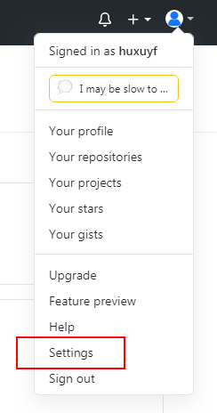
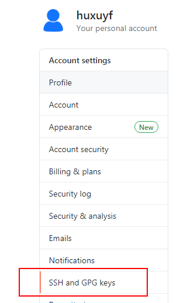
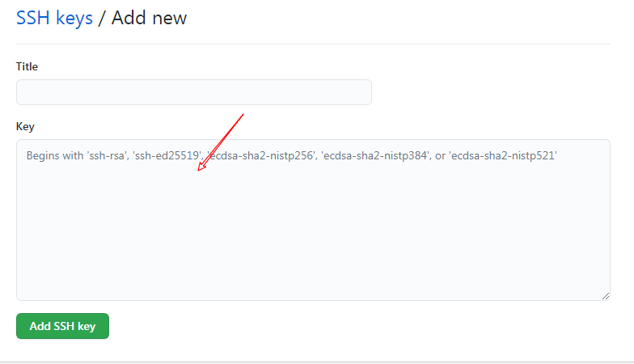
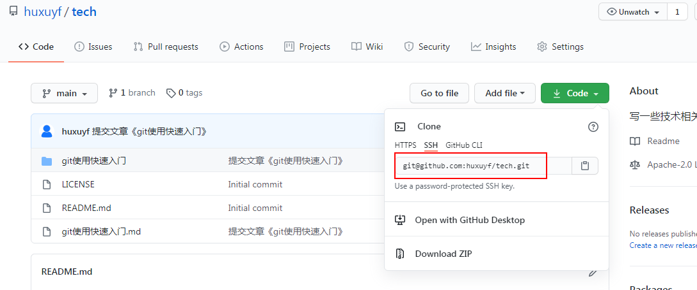
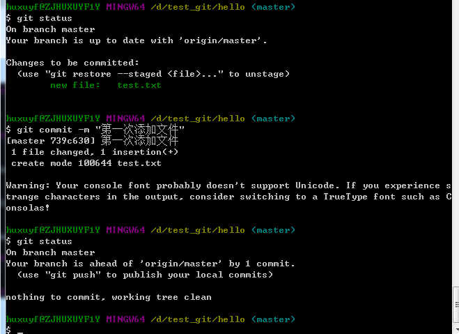
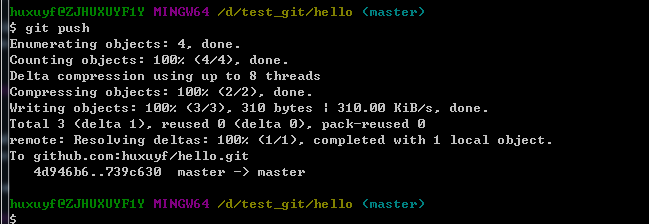
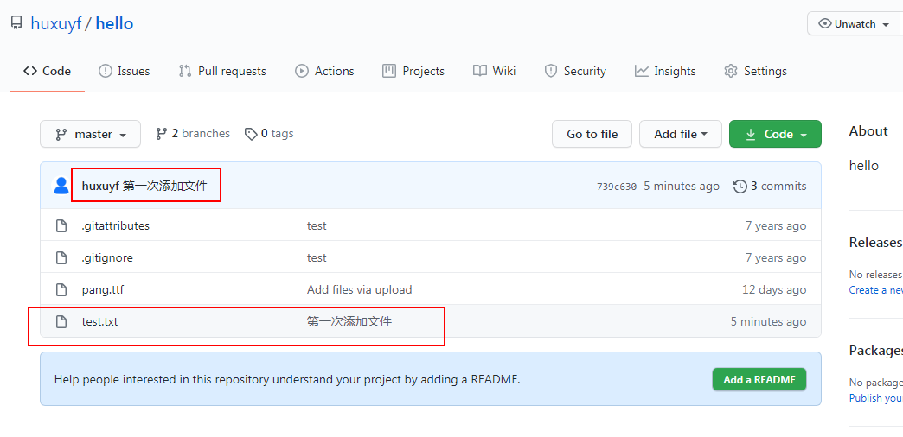
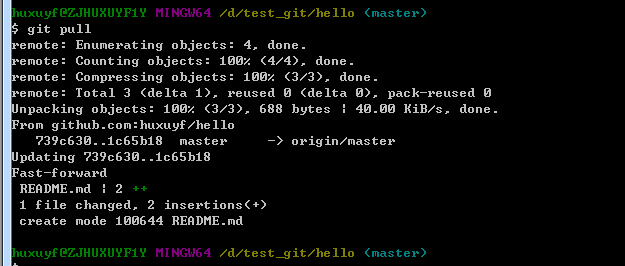
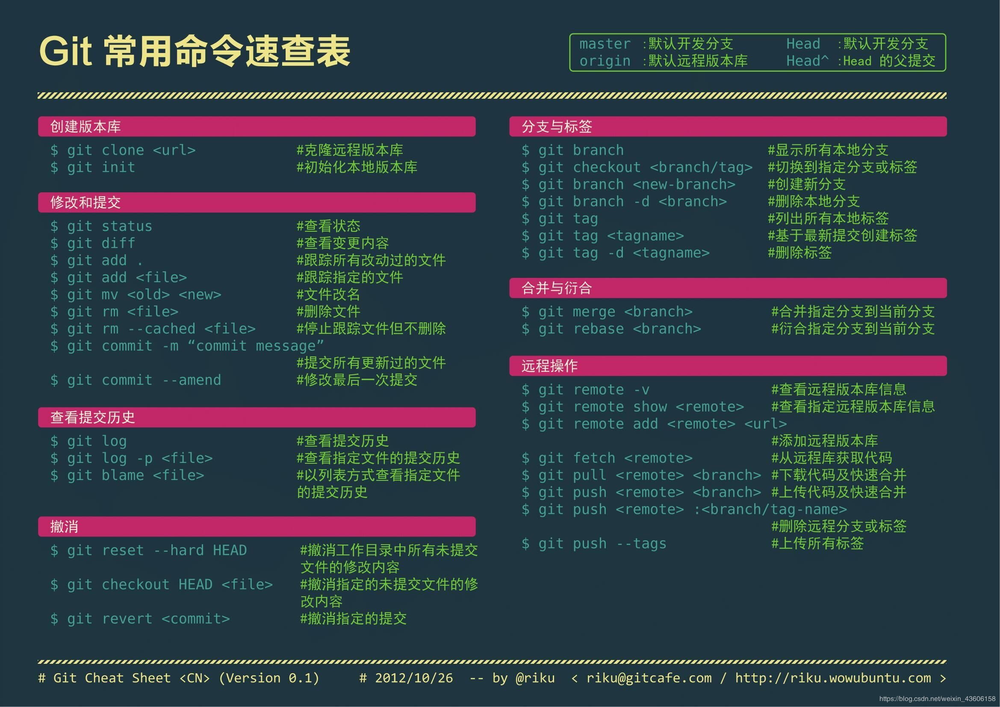
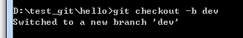

# Git使用快速入门

## 前言

Git是一个开源的分布式版本控制系统。这个定义比较深奥。我主要是用来适配Github的。当然通过Github的网站也能使用，但通过git命令行模式感觉更方便一些。

因为对于我个人使用来说，不太会遇到版本问题，与他人协作等问题，所以只会涉及到最简单的设置、提交、更新等操作。


## 一、Git的下载、安装

[官网](https://git-scm.com/) 


## 二、Git的本地配置

为了能够在本地使用git来操作Github，需要先在本地做一些必要的设置。

### 1、设置用户名、邮箱

```bash
git config --global user.name "ShingU"
git config --global user.email "shingu@gmail.com"
```

这是Github上的用户名和注册邮箱，用于连接Github的远程库。


通过下面这条命令，可以查看git的配置内容：

```bash
git config --global -l
```


### 2、SSH的生成和设置

#### 2.1 在本地生成SSH keys

```bash
ssh-keygen -t rsa -C "shingu@gmail.com"
```

这里使用的是在Github上注册的邮箱地址。执行这条命令后会让你输入地址、密码，不用管，一路回车即可。

最后可以在电脑的个人用户文件夹下找到一个**.ssh**文件夹，并在下面找到**id_rsa**和**id_rsa.pub**这两个文件。


#### 2.2 在Github上设置公钥

打开Github网站，并在个人设置中找到**SSH and GPG keys**





点击新建SSH keys，将之前**id_rsa.pub**文件用记事本打开，并将里面的内容复制进去



#### 2.3 验证是否成功

```bash
ssh -T git@github.com
```


### 3、解决中文乱码问题

```bash
git config --global core.quotepath false
git config --global i18n.commitencoding utf-8
git config --global i18n.logoutputencoding utf-8
```

执行上面三条命令，基本上可以避免遇到中文乱码的情况了。


## 三、Git的基本操作

### 1、在本地创建仓库

有两种方式：第一种是在本地初始化一个仓库（Github上还不存在的仓库），第二种是Github上已经存在仓库（可以是自己的，也可以是别人的）

第一种方式（不常用，知道即可）：

```bash
git init
```

第二种方式（推荐使用）：

```bash
git clone git@github.com:huxuyf/hello.git
```

后面的地址是这么来的：



克隆Github上的仓库，既能是自己的仓库，也能是别人的仓库。两者的区别是，自己的仓库如果有修改，可以提交上去，而如果是他人的仓库，需要进行pull request才行。

对于他人的仓库，除了直接clone，也可以先fork到自己的用户名下，然后再clone。


### 2、修改、提交

1. add-添加文件


```bash
git add "添加的文件名"
```

如果是多个文件，可以使用命令：

```bash
git add .
```

2. commit-提交文件



```bash
git commit -m "第一次提交"
```

-m 指的是备注信息（message的简写）

3. push-上传文件到远程仓库



```bash
git push
```

Github上的效果：



### 3、更新本地仓库

上面讲述的是如何将本地的变动提交到远程仓库，这里讲述如何将远程仓库的变动拉取到本地。

```bash
git pull
```

很简单，只需要执行这条命令即可。




## 四、Git命令速查表




## 五、小结

### 1、一次性命令备忘

以下命令为初始化、配置时使用，不会经常用到，但一定得知道：

``` bash
# 本地设置Github的用户名、邮箱
git config --global user.name "ShingU"
git config --global user.email "shingu@gmail.com"

# 用于避免出现中文乱码的情况
git config --global core.quotepath false
git config --global i18n.commitencoding utf-8
git config --global i18n.logoutputencoding utf-8

# 查看git的全局设置
git config --global -l

# 生成SSH keys
ssh-keygen -t rsa -C "shingu@gmail.com"
# 验证通过SSH连接是否成功
ssh -T git@github.com

```


### 2、常用命令

```bash
# 克隆远程仓库
git clone git@github.com:huxuyf/hello.git

# 添加所有变更的文件
git add .
# 提交文件
git commit -m "第一次提交"
# 上传到远程库
git push

# 将远程库的变动同步到本地库
git pull

# 查看本地库的状态
git status

# 查看远程库的信息
git remote -v
```


## 六、高级篇

### 一、分支篇

**查看分支：git branch**


**创建分支：git branch <name>**


**切换分支：git checkout <name>**
git checkout dev	# 切换到dev分支
git checkout main	# 切换到主分支


**创建+切换分支：git checkout -b <name>**



**合并分支：git merge <name>**
git merge dev	# 合并dev分支到主分支


**删除分支：git branch -d <name>**